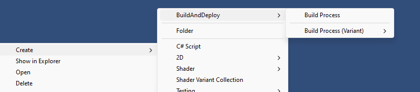
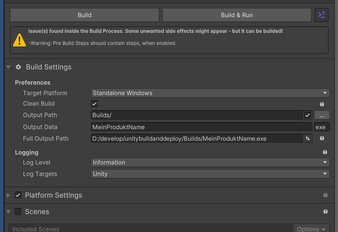
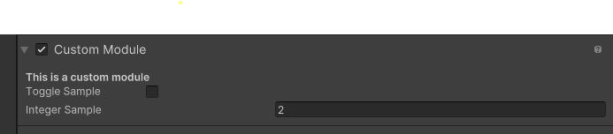
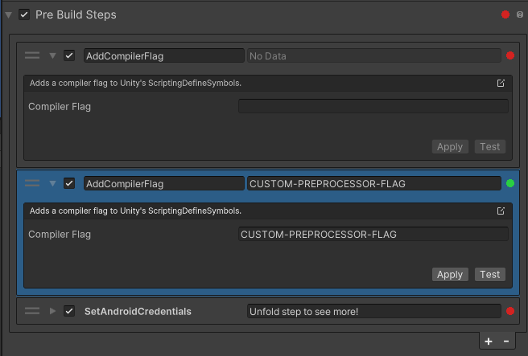
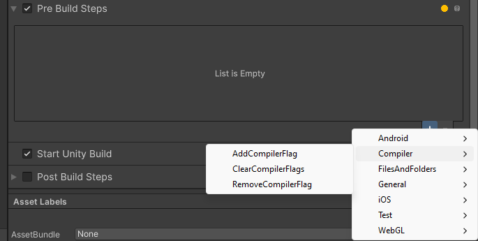
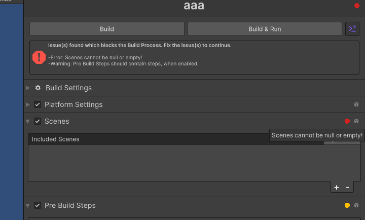
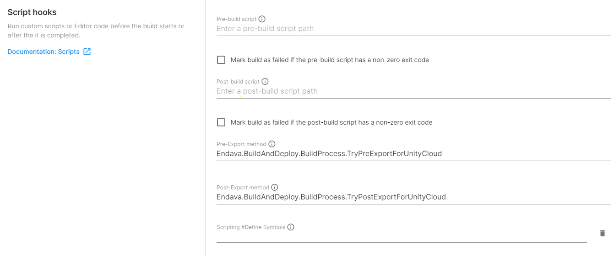
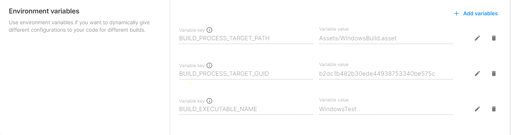
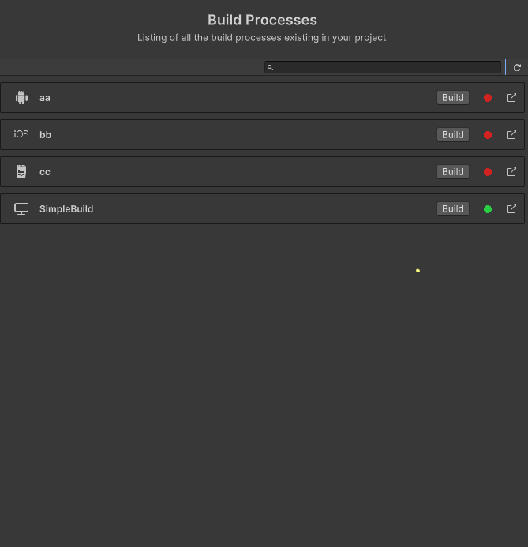

# Getting Started

## General 

Once you have installed the "Build and Deploy" package by using Unity's Package Manager you should be able to create **Build Process Assets** within your Unity project. Just use the Create Asset menu by right clicking in the project window of Unity and go to "Create/Build and Deploy/Build Process"

Using the variant items allows you to create predefined platform "Build processes".

Once created, use the inspector to edit the Build Process and allow you to customize the Unity Build Pipeline. Validation and "context aware" modules will help to streamline the process. Every "Build" should have its own "Build Process" object, so that your developers  only needs to address the "Build Process" objects to get the builds done. (like having a "Standalone", "Standalone Debug", "Steam", "Steam Release" etc... object each)

If at any point an exception or build issue raises, the build process will stop execute and, if configured, log relevant details accordingly in an isolated buildLog.log file.

## Modules

Once you created your Build Process and selected it, you have various folded modules within the Inspector.

Configure each module to your will. Once a configuration causes issues or warnings a yellow/red light should indicate those issues and upon hovering or next to the build buttons a description should appear.

### InBuild Module types

1. Build Settings (Main)
This module is responsible of all general build settings, like Deployment-OutputPath, Logging or the target platform itself. This module is essential and executes always at first.

2. Platform Settings  
The optional/toggleable platform settings module varies depending on the choosen target platform within the Build Settings. It will try to mimic the same settings, which Unity allows you to customize within the "Build Settings" (Ctrl+Shift+B) window. It allows you to set build options, like if the build is a development build or what kind of compression is used.

3. Scenes  
The optional/toggleable scenes module allows you to overwrite the scene list, which are exported within the build. (similar to the one within the Unity Build Settings window). Similar to Unity's Scene List, the first entry of this list is always the starting scene.

4. Pre BuildSteps  
The optional/toggleable Pre-BuildSteps can be used to execute any number of code BEFORE the actual Unity Build Pipeline starts. A various number of already implemented, commonly used build steps are provided within this package. Update the credentials, doing file copy actions or manipulate the Player Settings are done inside here.

5. Unity Build Module
This optional/toggleable module is referencing the actual Unity Build Pipeline and starts the time intensive internal build process. If you want to doing preconfigured platform switches, disable this module and just let the Build Process do the setup parts.

6. Post BuildSteps
This optional/toggleable module can be used to execute any number of code AFTER the Unity Build Pipeline finished. Similar to the Pre BuildSteps a high number of possible task (like file copy/move actions) can be addressed here. 

### Add custom modules

The Build Process can easily be extended by adding additional modules. This allows you to add any kind of additional module tasks in between of the given infrastructure (f.e. doing AssetBundle Build module or WebRequest related task). It is hard to distinguish, if a task might be worth an extra module, or if this could be done within an additional pre-/postbuild step - the decision is up to you.  
Just import/follow the *"CustomModule"* sample within this package to get a brief idea, of how to do it.

    [BuildModule(BuildExecutionMode.BeforeBuild, 10)]
    public class CustomModule : BuildProcessModule
    {
        public override string SectionName => "Custom Module";

        public override bool CanBeDisabled => true;
        [SerializeField] private int sampleInteger = 2;
        [SerializeField] private bool isToggled = false;

        public override async Task<bool> Execute()
        {
            ...
        }

        ...
    }

You will have full control about the inspector appearance and update cycles.

## BuildSteps

Build Steps allows you to execute additional logic/code before and after the actual Unity Build Pipeline starts/ends. Just think of 2 Standalone builds, where each of them needs to have a different package name/version number or Preprocessor flags set. Instead of doing this by hand on every version switch, use the PRE BuildSteps to change the needed PlayerSettings for you.  

Once added, configure the Buildstep by opening the step in the list and unfold it. 

Once unfolded, edit the inner properties to make the step valid and executable.  
Some steps might be "Testable" by using a "Test" button, which will execute the step and revert it instantly.  
The "Apply" button can be used to execute the step without reverting.  
Depending on the BuildStep the number of properties, validation conditions or platform requirements might change. You can also change the number if the step by editing it next to the enabling toggle (if you f.e. have high number of similar steps with unpractical preview).  
Every step in the Pre-/Post BuildSteps has an inner validation, while a general validation of all steps is represented next to the module title.

### InBuild BuildSteps

The package already includes various steps for:
- File/Folder manipulation
- Platform depending changes
  - Android credential changes
  - iOS Plist/XCode manipulations
  - WebGL manipulations
- Unit Test
- basic Player Setting manipulations (package name, version name)
- Platform dependant "Compiler Flag" manipulation

### Custom BuildSteps

You can easily extend the existing Build Steps within your project, if any kind of custom step is needed. Just create a class containing a BuildStep attribute and derived from either TestableBuildStep (if your step supports inEditor Testing) or BuildStep (if you have common, none-testable step). You can get an idea of how this can be done by importing the *"CustomSteps"* sample within this package.

    [Serializable, NewBuildStep("Samples/NonTestable Custom Step")]
    public class NonTestableBuildStepSample : NewBuildStep
    {
        // add a short description to make it clear what this step is doing
        public override string Description => "This is just a test";

        // add a preview (if possible), so that the step can be clearly identified in folded state
        public override string FoldedParameterPreviewText => fileName;

        [SerializeField]
        private string fileName = "test.txt";

        public override BuildValidation Validate()
        {
            ...
        }

        ...
    }

## Execution/Build

Once the configuration is completed and all issues/warnings are gone (no red or yellow lights existing) you can start the build process.

### Building by using Unity Editor Inspector

Simply hit the build button (if possible) and start the build process. Icons should indicate possible Errors|Warnings if something is misconfigured|unsupport or incorrect. When your build has been configured properly, start the build by using the build-button.

### Building by using Command Line

You can use the Unity CommandLine execution approach by inject static build methods within the Unity start process itself.
Combine this with the Unity command line arguments to get a specific build result. [Unity Commandline arguments](https://docs.unity3d.com/2021.2/Documentation/Manual/CommandLineArguments.html)

You have to specify **-batchmode** and **-executeMethod Endava.BuildAndDeploy.BuildFromCommandLine.Build** followed by a **"-buildProcess="** argument.

**Please always use "-buildTarget \<your platform\>" when you build to make Unity setup the platform target before anything gets executed**

The build process can generate (*BuildLogger.File is set*) an "isolated" build report within your Unity Log folder name "buildLog.log", where you can inspect the build separately.

#### Command Line Options

| Parameter | required | Description |  Sample |
|:----------------------:|:-----:|:-------------------------------------:|:----------------------:|
|**-buildProcess=\<asset-file\>** | **true** | Specify the build process within Unity's asset path you want to build | -buildProcess="Assets/BuildSetting/Android.asset"|
| -android-sdk=\<value\> | false | Overwrites the used android sdk within an android build | -android-sdk="c:\\android\\tools\\install\\location\\platforms\\android–27" |
| -android-ndk=\<value\> | false | Overwrites the used android ndk within an android build | -android-sdk="c:\\android\\tools\\install\\location\\android-ndk-23" |
| -overrideLogTargets=\<flags\> | false | Allow you to override the logging target (None,Unity,File,Console,Everything) | overrideLogTargets=Unity,File |
| -overrideLogLevel=\<level\> | false | Allow you to override the logging level (Debug,Information,Warning,Error) | -overrideLogLevel=Warning |
| -overrideFullOutputPath=\<abs-path\> | false | Allow you to override the builds output path as fully qualified output path | -overrideFullOutputPath="C:\\builds\\android\\mygame.apk" |

#### Some CommandLine Samples:

*Starts a standalone build with the name "MyBuildProcess.asset" on a windows machine.*

    C:\Program Files\Unity\Editor\Unity.exe -projectPath "C:\Projects\CoolProject" -batchmode -buildTarget Standalone -executeMethod Endava.BuildAndDeploy.BuildFromCommandLine.Build -buildProcess=Assets/MyBuildProcess.asset

*Starts a android build with the name "MyBuildProcess.asset with no logging on a windows machine.*

    C:\Program Files\Unity\Editor\Unity.exe -projectPath "<yourProjectPath>" -batchmode -buildTarget Android -executeMethod Endava.BuildAndDeploy.BuildFromCommandLine.Build -buildProcess=Assets/MyBuildProcess.asset -overrideLogTargets=None

*Starts a WebGL build with the name "MyBuildProcess.asset with overwritten logging target and level on a windows machine.*

    C:\Program Files\Unity\Editor\Unity.exe -projectPath "<yourProjectPath>" -batchmode -buildTarget WebGL -executeMethod Endava.BuildAndDeploy.BuildFromCommandLine.Build -buildProcess=Assets/MyBuildProcess.asset -overrideLogTargets=Everything -overrideLogLevel=Debug

*Starts a standalone build with the name "MyBuildProcess.asset with overwritten output path on a windows machine.*

    C:\Program Files\Unity\Editor\Unity.exe -projectPath "<yourProjectPath>" -batchmode -buildTarget Android -executeMethod Endava.BuildAndDeploy.BuildFromCommandLine.Build -buildProcess=Assets/MyBuildProcess.asset -overrideFullOutputPath=C:/Build/builded.exe

*Starts a standalone build process with the name "MyBuildProcess.asset on a macosx machine.*

    /Applications/Unity/Unity.app/Contents/MacOS/Unity -projectPath "<yourProjectPath>" -batchmode -buildTarget Standalone -executeMethod Endava.BuildAndDeploy.BuildFromCommandLine.Build -buildProcess=Assets/MyBuildProcess.asset

### Building using Unity Cloud Build

You can Unity Cloud Build with this build pipeline as well. Just keep in mind, that the **Unity Cloud Build configurations skips** some of the existing build process modules within the build process. Since every Cloud configuration has its own build prerequisits (like the Build Platform settings, Output path or cleaning approach) we have to decide, which one might be worth being overwritten by our build process vs. creates confusion within the build steps.  

The pre-export method will only execute modules, which are part of the "BeforeBuild" attribute, while the post-export method will only execute modules, which are tagged with the "AfterBuild" attribute.

To be a bit more explicit, here a list of the current executes modules:

| Module | ExecutionMode | Executed | Explanation |
|:----------------------:|:-----:|:-------------------------------------:|:----------------------:|
| *MainModule* | Setup | **SKIPPED** | The build configuration will overwrite all build output, cleaning, execution name,... properties |
| *Build Platform Settings* | Setup | **SKIPPED** | Again, all settings will be configured within the Cloud configuration |
| **Scene Module** | BeforeBuild | **EXECUTED** | The module will overwrite the Build Settings scenes, since it is much safer and easier to do the correct scene setup in this module, than using the Cloud Build configuration |
| **Pre Build Steps Module** | BeforeBuild | **EXECUTED** | The "main use case" of the Build Process is to execute all PreBuild steps and configure your build properly |
| *Unity Build Module* | Build | **SKIPPED** | Will executed by Cloud once the Pre-Export method completed |
| **Post Build Steps Module** | AfterBuild | **EXECUTED** | Once the build completed the Cloud starts the Post-Export, which triggers the Post Build steps module and others |

#### Configure your Cloud build Config

Create your Unity Cloud configuration using the service web interface. To let the Build Process take care about the pre and post build execution, add the following strings into the Pre-/Post Export field:

    Pre-Export method = Endava.BuildAndDeploy.BuildProcess.TryPreExportForUnityCloud

    Post-Export method = Endava.BuildAndDeploy.BuildProcess.TryPostExportForUnityCloud

This will allow the Build Process to execute all "BeforeBuild"/"AfterBuild" relevant modules.  

To identify your "Build Process object" pass one of the 2 Environment variables to your Cloud configurations advanced settings.

    BUILD_PROCESS_TARGET_PATH = <Your project related Build Process path>

    BUILD_PROCESS_TARGET_GUID = <Your Build Process GUID>

If you have specified an "executable name", which differs from your current build name, specify an additional environment variable to allow your post build and possible after scripts to be parsed correctly:

    BUILD_EXECUTABLE_NAME = <should match the "Executable Name" field within your cloud config>

Once these steps are accomplished, the Build Process should inject itself into the Cloud Build build process and execute every related module accordingly.

## Build Overview Window

The Build and Deploy package contains a small editor window, which allows you to get an overview about the existing Build Process objects within your project. Use it as a general overview or as a shortcut to your existing Build Processes.

